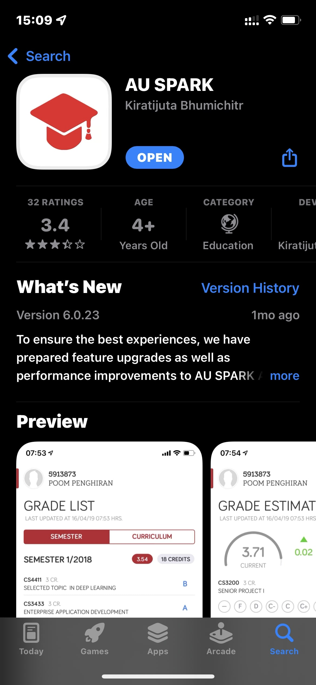

# QTEMP: Assumption University Body Temperature Recording System

 

## What is QTEMP?

QTEMP is a cross-platform desktop app for Assumption University's employees to record students' body temperature daily into the system to inform which student has a normal temperature and which has a precaution temperature within the classroom. Once the result has been committed into the system, it will alert a mobile phone notification into a student phone. The instructor of a specific class can visualize every student's temperature status via the AU Spark app of Assumption University.

